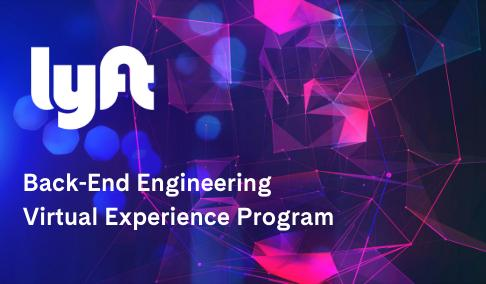
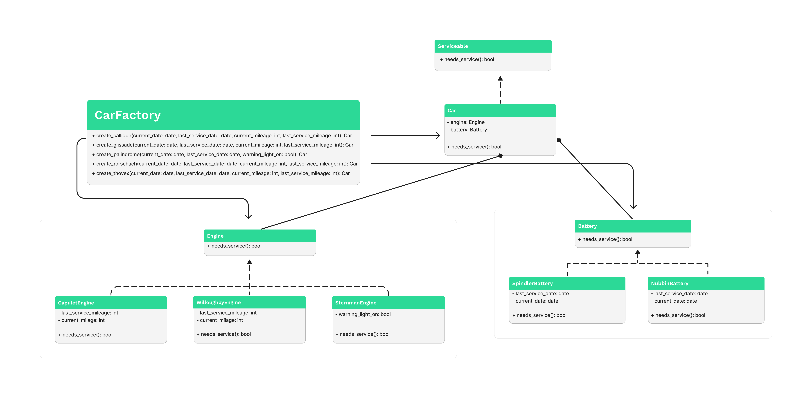

<h1 align="center">
   

   
  Lyft’s virtual experience program
   
</h1>

  <a href="#about">About</a> •
  <a href="#tasks">Tasks</a> •
  <a href="#skills">Skills</a> •
  <a href="#uml">UML</a> •
  <a href="#additional-topics">Additional topics</a>

## About
Lyft’s virtual experience is a program where you can take on practical tasks similar to what Lyft engineers would work on and get a true feel of what it’s like to work there as a back-end engineer.

## Tasks
There was a component that is used by the rental fleet’s new logistics system. 
My responsibility was to finalize that component and make it functional.
The component itself is responsible for determining whether cars in Lyft’s new rental fleet should be serviced when they are returned. 

Throughout the program, I had to solve the following tasks:
 - Come up with a clean design for an existing, unfinished component (draft a UML class diagram)
 - Refactor a messy codebase
 - Write unit tests for your newly refactored system
 - Add new functionality to your system using Test-Driven Development

## Skills

Skills have been acquired:
- Software Architecture
- Python
- UML
- Refactoring
- Unit Testing
- TDD

## UML
UML class diagram that represents a new reorganized architecture
<h1 align="center">
   

</h1>

## Additional topics

I got familiar with following topics:
- Composition over inheritance
- UML Class Diagram
- Factory Method (design pattern)

